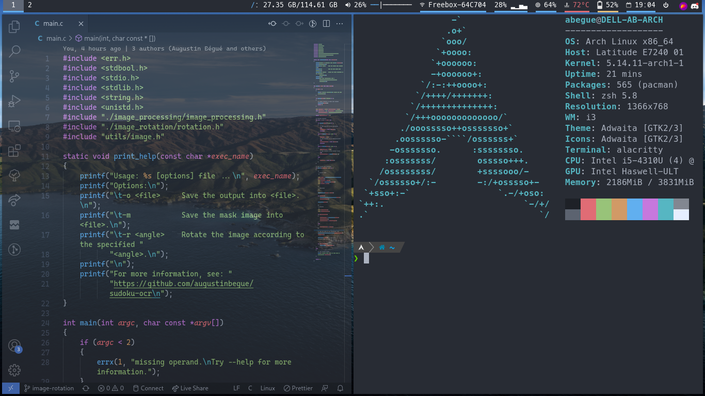

# arch-dotfiles

Dotfiles for the arch + i3 setup running on my laptop.

They are partely based on my [wsl](https://github.com/augustinbegue/wsl-dotfiles) setup.

Screenshot of what it looks like:


## Installation

```sh
alias config='/usr/bin/git --git-dir=$HOME/.cfg/ --work-tree=$HOME'
```

```sh
echo ".cfg" >> .gitignore
```

```sh
git clone --bare https://github.com/augustinbegue/arch-dotfiles $HOME/.cfg
```

```sh
mkdir -p .config-backup && \
config checkout 2>&1 | egrep "\s+\." | awk {'print $1'} | \
xargs -I{} mv {} .config-backup/{}
```

```sh
config checkout
```

```sh
config config --local status.showUntrackedFiles no
```
